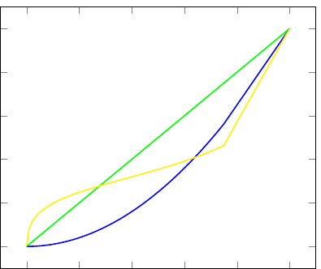

% Presentation Numerical Simulation
% Assignment 2
% An assignment of Risk and Time

Introduction
================

- Hereby I present the [document](http://gitver.github.io/repo4/) from the other GitHub page.
- This assignment was originally made by: me, Edgar Brouwer, Jonathan Koets, Jules Perry and Arjan Spaans.

Exercise 1:
================

Consider an urn with 9 balls: 3 balls are red and the remaining 6 balls are eitherall green or all yellow. Thus, the urn contains 3 red and 6 greens balls, or 3 redand 6 yellow balls. One ball will be drawn at random from the urn. Considerthe prospects A = (R: 100; Y: 0; G: 0), B = (R: 0; Y: 100; G: 0), C = (R: 100;Y: 0; G: 100), and D = (R: 0; Y: 100; G: 100), where R, Y, and G denote theevent that a red, yellow, and green ball will be drawn from the urn.

--------

a) It has been found that most people prefer prospect A to B, while they si-multaneously prefer prospect D to prospect C. Show that this choice patternviolates Subjective Expected Utility.
since:

$$
\sum_{i} B(E_i)uX_i
$$

-------
SEU(A) = $\displaystyle\frac{3}{9}\times0+\frac{1}{2}\times\frac{6}{9}\times0+\frac{1}{2}\times\frac{6}{9}\times0=33\frac{1}{3}$

SEU(B) = $\displaystyle\frac{3}{9}\times0+\frac{1}{2}\times\frac{6}{9}\times100+\frac{1}{2}\times\frac{6}{9}\times0=33\frac{1}{3}$

SEU(C) = $\displaystyle\frac{3}{9}\times100+\frac{1}{2}\times\frac{6}{9}\times0+\frac{1}{2}\times\frac{6}{9}\times100=66\frac{2}{3}$

SEU(D) = $\displaystyle\frac{3}{9}\times0+\frac{1}{2}\times\frac{6}{9}\times100+\frac{1}{2}\times\frac{6}{9}\times100=66\frac{2}{3}$

--------

Since SEU(A)=SEU(B) and SEU(C)=SEU(D) people should be indifferent between choosing prospect A and B and between choosing prospect C and D.

--------
B) Show that the $\alpha$-MEU model can accommodate the majority choice.

$\alpha$-MEU( f )=$\alpha$minp$\epsilon$C(Ep[u( f )]) + (1-$\alpha$)maxp$\epsilon$C(Ep[u( f )])

$\alpha$= 0.8

--------
$\alpha$-MEU(A) = $\frac{1}{3}\times100 = 33\frac{1}{3}$

$\alpha$-MEU(B) = $\frac{4}{5}\times(0\times100)+(1-\frac{4}{5})\times(\frac{2}{3}\times100) = 13\frac{1}{3}$

$\alpha$-MEU(C) = $\frac{4}{5}\times(\frac{1}{3}\times100)+(1-\frac{4}{5})\times(1\times100) = 13\frac{1}{3}$

$\alpha$-MEU(D) = $\frac{2}{3}\times100 = 66\frac{2}{3}$

--------
Thus, since $\alpha$-MEU(A) $>$ $\alpha$-MEU(B) and $\alpha$-MEU(D) $> \alpha$-MEU(C) the $\alpha$-MEU model can accommodate the majority choice.

--------
c) Show that the Recursive Expected Utility model can accommodate the majority choice.

REU( f ) = E$\mu$[$\phi$(Ep$\epsilon$C[u( f )])]

$\phi = x^{0.5}$

-------
REU(A) = $\displaystyle(\frac{1}{3}\times100)^{\frac{1}{2}}=5.77$

REU(B) = $\displaystyle\frac{1}{2}\times(\frac{2}{3}\times100+\frac{1}{3}\times0)^{\frac{1}{2}} + \frac{1}{2}\times(0\times100+\frac{2}{3}\times0+\frac{1}{3}\times0)^{\frac{1}{2}} =4.08$

REU(C) = $\displaystyle\frac{1}{2}\times(\frac{1}{3}\times100+\frac{2}{3}\times100)^{\frac{1}{2}} + \frac{1}{2}\times(\frac{1}{3}\times100+\frac{2}{3}\times0)^{\frac{1}{2}} =7.88$

REU(D) = $\displaystyle\frac{1}{2}\times(\frac{2}{3}\times100)^{\frac{1}{2}} + \frac{1}{2}\times(\frac{2}{3}\times100)^{\frac{1}{2}} =8.16$

--------
Since $REU(A)>REU(B) and REU(D)>REU(C)$ recursive expected utility can accommodate the majority choice.

Exercise 2
=================
When choosing between uncertain alternatives, Mary maximizes cumulative prospect theory with a weighting (source) function for a ball drawn from an urn with a known composition of balls (K) equal to the weighting function for the performance of the Dow Jones index, both given by: $wK(p)=wDOW(p)=p^2$. The weighting function for balls drawn from an urn with an unknown composition of colored balls (U), as well as the weighting function for the performance of the AEX index are given by $wU(p)=wAEX(p)=\frac{p^{0.5}}{((p^{0.5}+(1-p)^{0.5})^2)}$. Mary's utility function is $u(x)=x^{0.88}$

--------
a)Show that Mary can be ambiguity seeking for unlikely events and ambiguity averse for events of moderate likelihood when comparing lotteries with prizes depending on balls drawn from either the risky or the unknown urn.

--------

- and we have another slide

   - and nested bullets

- the next slide contains a figure

---------

Yellow: Unkown urn

Blue: Known but Risky urn

Green: Line with weighting according to probability 

---------
b) Show that Mary can exhibit the home bias, assuming that she beliefs that the Dow Jones index and the AEX index will go up (and down) with probability 0.5.
In this case Mary gains \$100 dollar if the AEX or the Dow Jones will go up: 

$wK(0.5)=0.25; wU(0.5)=0.3535$

$wK(0.5)\times100=25; wU(0.5)\times100=35.35$

u(25)=16.99; u(35.35)=23.05

From this it shows that although the probability for both stock exchanges to go up is equal, Mary is more willing to invest in the AEX index. If Mary is Dutch, this is a case of the Home Bias.

- we can also do a figure from the web

---------
